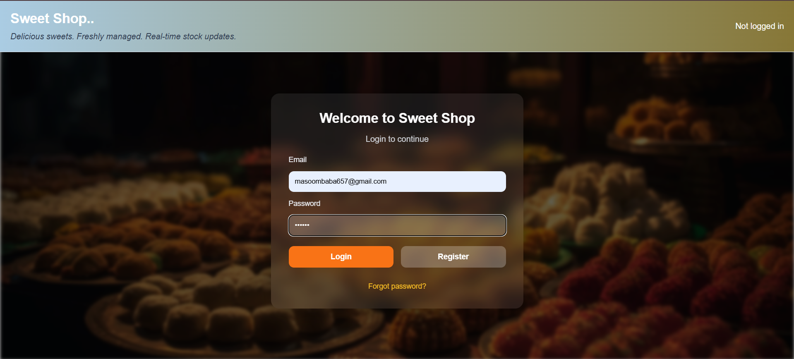
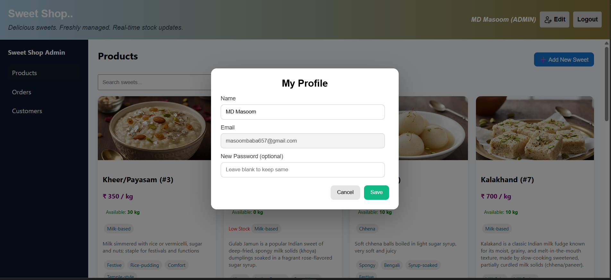
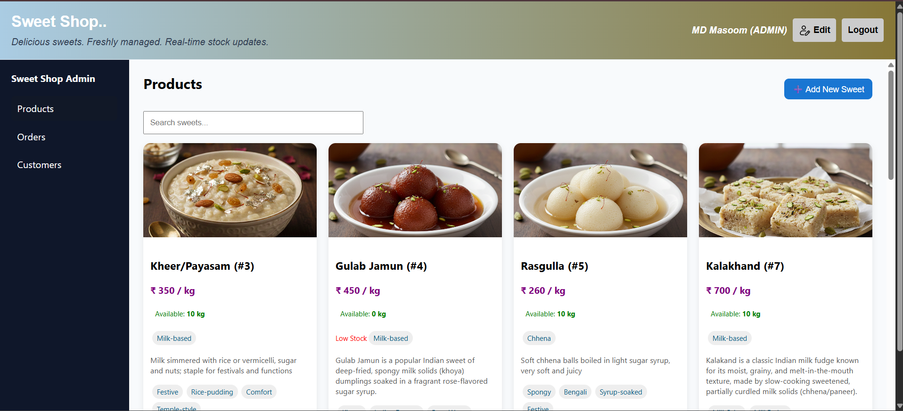
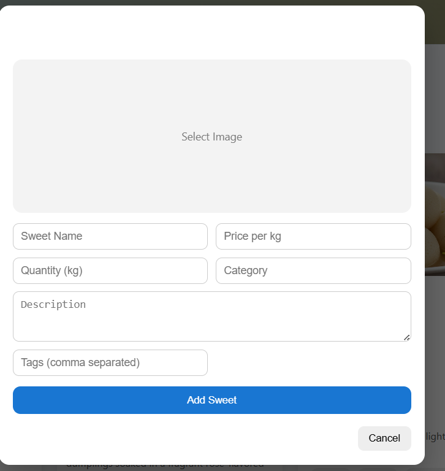
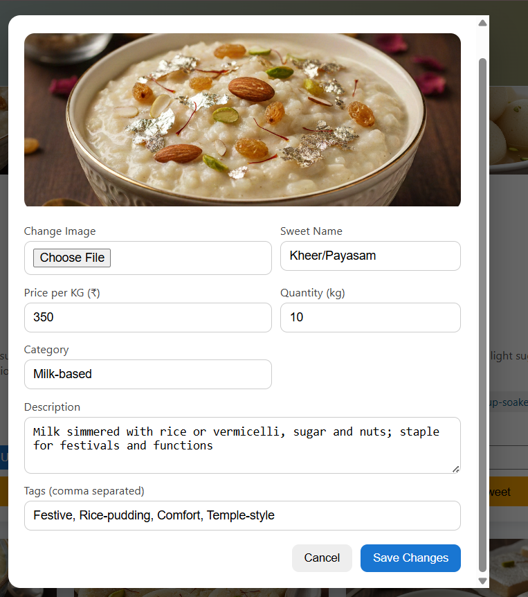
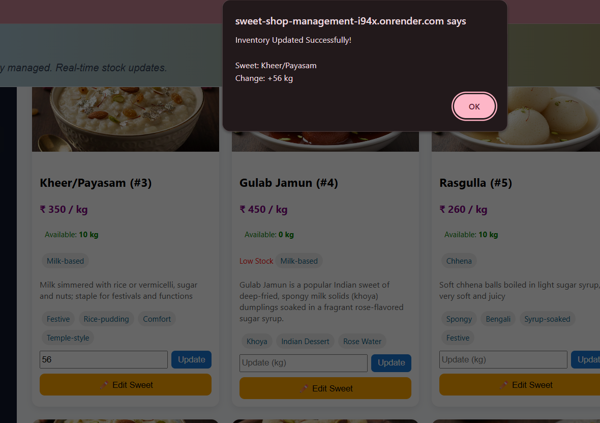
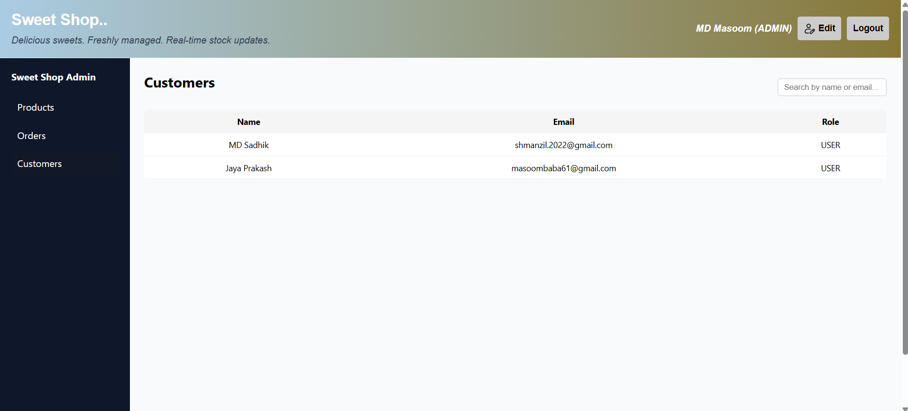
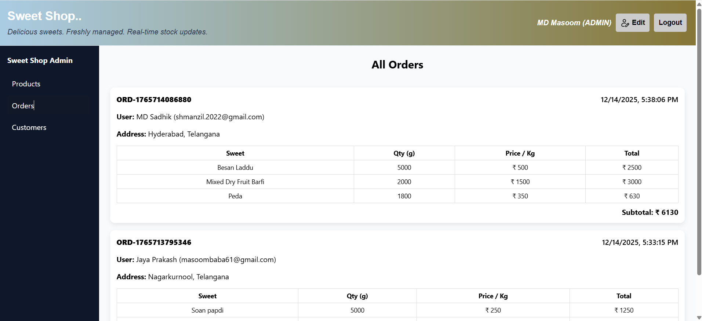

🍬 Sweet Shop Management System

🚀 Live Application
👉 https://sweet-shop-management-i94x.onrender.com/

🛠 Admin Credentials

Email: masoombaba657@gmail.com

Password: 123456

👤 Customer (User) Credentials

Email: masoombaba61@gmail.com

Password: 123

ℹ️ Important Notes

You may register a new customer account if desired.

To access admin features, you must log in using admin credentials.

The application automatically redirects users based on their role:

Admin → Admin Dashboard

Customer → Customer Home Page

A full-stack Sweet Shop Management System that allows customers to browse, search, and purchase sweets, while administrators manage inventory, pricing, and orders.
The application supports real-time inventory updates, OTP-based order confirmation, and secure role-based access.

## 📸 Application Preview

### 🔐 Login & Profile

---

### 👤 Customer Screens

/home.png)

/search.png)

/cart.png)

/order-otp.png)

/bill-details.png)

/my-orders.png)

---

### 🛠 Admin Screens

🚀 Features

User Authentication – Secure registration and login using JWT.

Role-Based Access – Separate access control for customers and admins.

Sweet Browsing – View all available sweets with price and stock details.

Search & Filters – Search sweets by name, category, or price range.

Cart Management – Add items to cart with automatic price calculation.

OTP Order Confirmation – Verify orders using email-based OTP.

Email Notifications – Order and bill confirmations sent via SendGrid.

Billing System – Auto-generated bill with order summary and total amount.

Order History – Customers can view past orders and purchase details.

Real-Time Inventory – Live stock updates using WebSockets (Socket.IO).

Admin Sweet Management – Admins can add, edit, and delete sweets.

Inventory Restocking – Admin-only stock replenishment with live updates.

Customer Management – Admins can view and search registered users.

Order Management – Admins can monitor and manage all customer orders.

Secure APIs – Protected endpoints with validation and authorization.

🏗 Tech Stack
Backend

Node.js

Express.js

MongoDB (Mongoose ODM)

JWT Authentication

Socket.IO

SendGrid

Frontend

React (Vite)

Axios

Socket.IO Client

🛠 Local Setup & Run Instructions

Follow the steps below to run the project locally.

✅ Prerequisites

Ensure the following are installed:

Node.js (v18 or higher)

npm

MongoDB (Local or Atlas)

SendGrid account (for OTP & emails)

📂 Project Structure
sweet-shop-management-system/
├── backend/
├── frontend/
└── README.md

⚙️ Backend Setup (Express + MongoDB)
1️⃣ Navigate to backend directory
cd backend

2️⃣ Install dependencies
npm install

3️⃣ Configure environment variables

Create a .env file inside backend:

PORT=4000
MONGO_URI=mongodb://localhost:27017/sweet-shop
JWT_SECRET=your_jwt_secret_key
SENDGRID_API_KEY=your_sendgrid_api_key
EMAIL_FROM=your_verified_sender_email

⚠️ Do not commit .env to GitHub

4️⃣ Start MongoDB

Local MongoDB

mongod

OR MongoDB Atlas

Create a cluster

Copy the connection string

Replace MONGO_URI in .env

5️⃣ Start backend server
node server.js

Backend runs at:

http://localhost:4000

🎨 Frontend Setup (React + Vite)
1️⃣ Navigate to frontend directory
cd frontend

2️⃣ Install dependencies
npm install

3️⃣ Start development server
npm run dev

Frontend runs at:

http://localhost:5173

🔄 Real-Time Communication

WebSockets (Socket.IO) enabled automatically

Real-time stock updates across all users

Ensure backend is running before frontend

📧 Email & OTP Testing (SendGrid)

Verify sender email in SendGrid dashboard

Use the verified email in EMAIL_FROM

OTP emails are sent during order confirmation

Check inbox or spam folder

🚨 Common Issues & Fixes
Issue	Solution
MongoDB connection error	Check MONGO_URI
OTP email not received	Verify SendGrid API key & sender
Socket.IO not updating	Ensure backend is running
CORS error	Check backend CORS settings

Finally Deployed Backend and Frontend in Render and here is the Deployed Website Link : https://sweet-shop-management-i94x.onrender.com/

